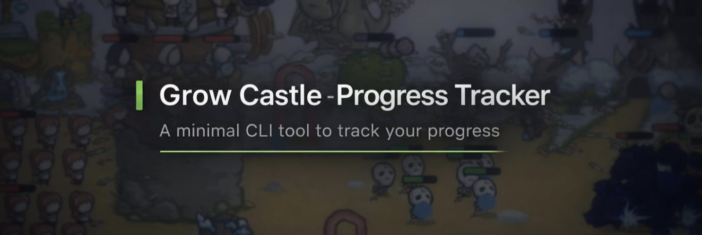

**A lightweight, efficient command-line tool written in C to track your progress in *Grow Castle***.


It allows you to:
- Track wave progression and Infinity Castle levels
- Calculate efficiency ratios and compare them with recommended upgrade benchmarks
- Visualize progress history using simple terminal graphs
- Save data locally for long-term tracking and analysis
- Modify previously entered data to keep tracking accurate

---

## Quick Start

### Requirements
- Windows, Linux, or macOS
- Git
- GCC compiler
- Make

### Installation

Clone the repository and build the project:

```bash
git clone https://github.com/miglioDev/grow-castle-progress-tracker.git
cd grow-castle-progress-tracker
make run
```

The program will compile and start automatically.

### Platform Notes

**Windows**

* Recommended: install Git Bash and use the commands above

**Linux / macOS**

* Use your system terminal
* If `make` or `gcc` are missing, your package manager will prompt you to install them

### Running the Program

After building the project, you can start it anytime with:

```bash
cd grow_castle_tracker
./bin/grow_castle_tool
```
---

## 📖 How to Use

- **Manage Player Data:** Insert, view, or modify wave, leader, heroes, and Infinity Castle statistics
- **Ratios & Suggestions:** Check whether your upgrades are balanced and efficient
- **Colony Stats:** View gold production and colony efficiency metrics
- **Progress History:** Visualize your progression over time using terminal graphs
- **Import / Export Data:** Back up your progress or move it between devices

All your data is stored locally inside the `/data` folder using a CSV file and is automatically updated whenever new stats are saved.

## Technical Overview

The application is written in **C** and uses simple data structures to manage player statistics during runtime.

- Player data is loaded into memory, processed, and saved locally
- Data persistence is handled using a **CSV file** with numeric values
- The program runs entirely offline, with no network access or external services
- A basic **Makefile** is used to compile and run the project

---

##  Features Preview

### Main Menu
The central hub for all your tracking needs - easy navigation and clear options.


---

###  Ratio Analysis & Suggestions
Get detailed information about your current set-up, levels and ratios.


---

### 📊 Progress Visualization
Visualize your wave progression over time with clean terminal graphs to track your growth trends.


---

## Feedback & Contributions

Contributions, bug reports, and suggestions are welcome.

You can:
- Open an issue on GitHub for bugs or feature requests
- Submit a Pull Request with improvements
- Contact me on Discord: **@miglioDev**

---

## 🧾 License

This project is released under the **MIT License**.

[](https://opensource.org/licenses/MIT)

You're free to modify, distribute, and build upon it — just give credit.

---

⭐ *If you like this project, consider giving it a star on GitHub to support future updates!*

