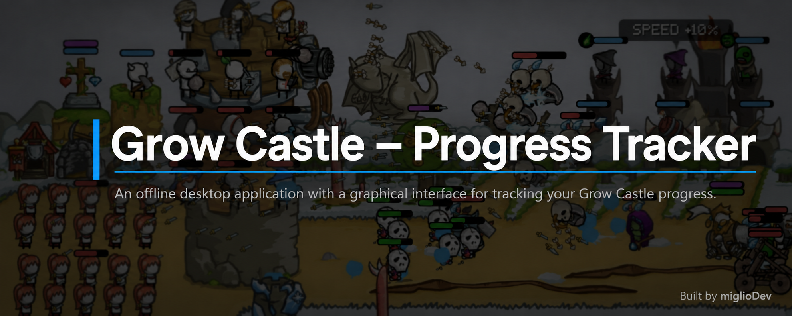
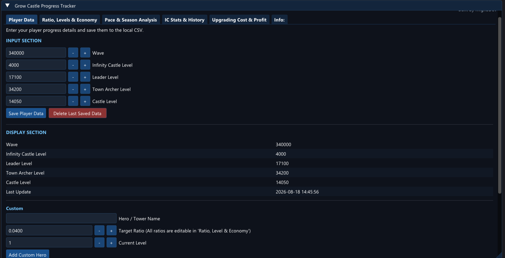
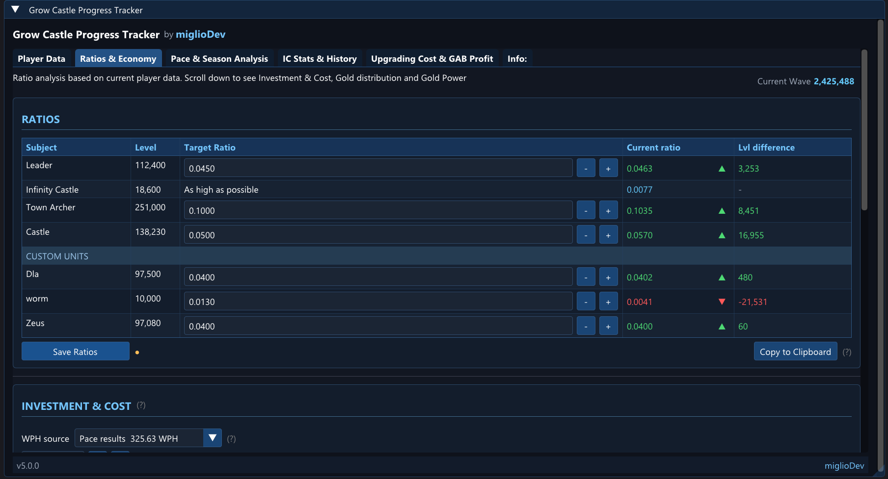
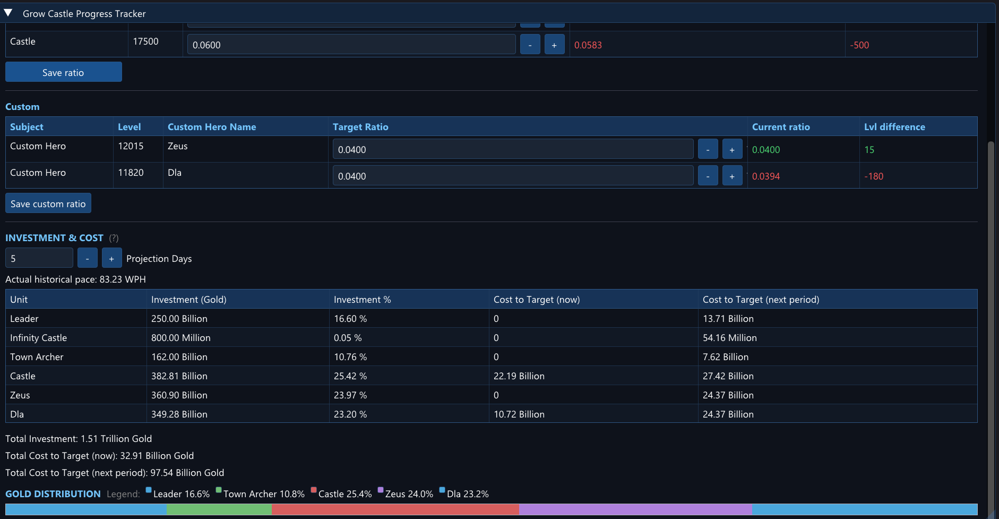
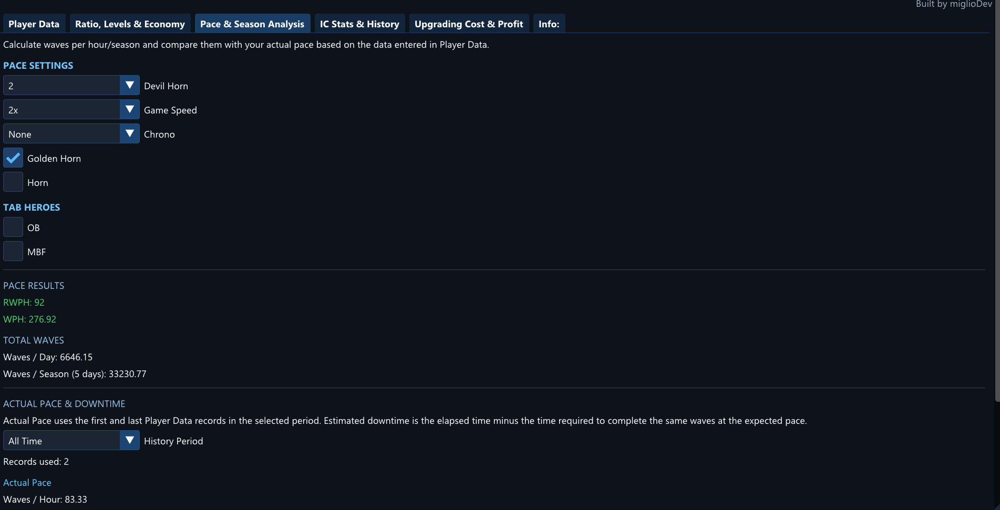
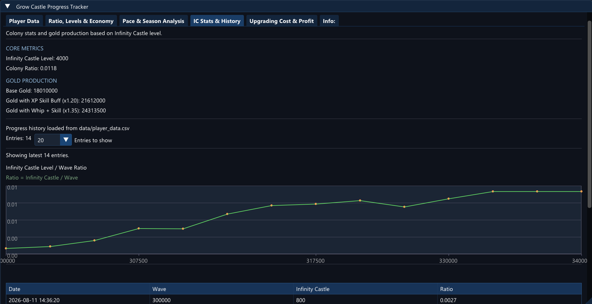

**A free and open-source Grow Castle progress tracker built to help players analyze their growth, plan upgrades, and track their journey over time.**


## Why?

Hi, I'm miglioDev, and I've been playing Grow Castle for a few years now.

I created this tool because I wanted a complete way to track my progress over the long term, analyze my growth, check ratios, and calculate upgrade costs and profit, all in one place.

So I started developing this application: a dedicated progress tracker built specifically for Grow Castle players.

The application works offline at runtime, and all data is stored locally on your computer. No accounts, cloud services and it is also cross-platform and works on Windows, Linux, and macOS.

I hope this tool can help other players track their progress, plan their upgrades, and push their waves even further! 

## Features

- **Player data tracking:** Save wave, Infinity Castle, Leader, Town Archer, and Castle levels with timestamps. Keep a local history of every saved snapshot, delete the latest snapshot when needed, and add custom heroes or towers with their own levels and target ratios.
- **Ratio and economy analysis:** Compare current levels with recommended ratios, edit the targets, inspect level gaps, and review Infinity Castle colony gold production.
- **Investment planning:** See the gold invested in each unit, its percentage of the total investment, the cost to reach the current target, and the projected cost for the next period.
- **Pace and season analysis:** Calculate RWPH, WPH, waves per day, and waves per five-day season from Devil Horn, game speed, horns, Chrono, and tap heroes. Compare the calculated pace with real progress snapshots and estimate downtime for selectable periods.
- **Profit estimates:** Estimate TAB gold for the latest tracked period and for a future projection. The estimate uses existing RWPH, the starting wave, the active period, and the calculated downtime; no extra gameplay input is required.
- **Progress history:** Review the Infinity Castle-to-wave ratio over time in a graph and table.
- **Upgrade costs:** Calculate the gold required to move Castle, Town Archers, or Leader/Hero/Tower units from one level to another.
- **Local and cross-platform:** The application works offline, stores data in local CSV files, and supports Windows, Linux, and macOS.

##  Features Preview

### Player Data

Enter and save your current progress, including waves, Infinity Castle, Leader, Town Archer, and Castle levels.



### Ratio, Levels & Economy

Compare your current unit levels with recommended ratios and adjust your targets as your build develops.



Review unit investments, cost-to-target planning, and the economy overview with its graphical breakdown.



### Pace & Season Analysis

Calculate your wave pace, seasonal progress, and estimated downtime from your current bonuses and tracked snapshots.



---

### IC Stats & History

Review Infinity Castle gold production and follow your Infinity Castle-to-wave ratio over time.


---

## Download & Installation

The easiest way to use Grow Castle Progress Tracker is to download the latest release from GitHub.

### Windows

Follow the installation tutorial This tutorial is valid from version 3 onwards:

[](https://www.youtube.com/watch?v=GamVHt7rb6Y)

1. Download the latest Windows ZIP file from the [Releases](../../releases) page.
2. Extract the ZIP file to your preferred location.
3. Open the extracted folder and run `GrowCastleProgressTracker.exe`.

Windows may show a "Windows protected your PC" warning because the application is not digitally signed yet.

This is expected for independent open-source applications. The source code is publicly available on GitHub, and anyone can inspect how the application works.

Click:
`More info` → `Run anyway`

Keep the `data` folder in the same directory as the executable.

Your progress data is stored locally inside the `data` folder.

---

## Build & Run (For Developers)

This section explains how to compile the application directly from the source code.
Download the repository and open a terminal in its root directory. The project uses CMake to build the graphical application.

### Dependencies

- **All platforms:** Git, CMake 3.16 or newer, and a C/C++ compiler
- **Linux:** GCC or Clang, Ninja (or another CMake generator), and OpenGL development libraries
- **macOS:** Xcode Command Line Tools, Ninja (or another CMake generator), and an OpenGL-compatible development environment
- **Windows:** Visual Studio Build Tools or MinGW, plus Ninja if using the Ninja generator

The graphical CMake build downloads GLFW and ImGui during configuration through CMake FetchContent.

### CMake Build

Configure and build with Ninja:

```bash
cmake -S . -B build -G Ninja
cmake --build build --config Release
```

Run the GUI on Linux or macOS:

```bash
./build/bin/GrowCastleProgressTracker
```

On Windows PowerShell, run:

```powershell
.\build\bin\GrowCastleProgressTracker.exe
```

With Visual Studio instead of Ninja, omit `-G Ninja`, build with `cmake --build build --config Release`, and run `build\bin\Release\GrowCastleProgressTracker.exe` on Windows.

---

## How to Use

1. Open **Player Data** and enter your current wave and unit levels. Save a snapshot whenever you want to record progress. More snapshots improve historical pace and downtime estimates. A snapshot cannot be saved if any field contains 0 or a negative value.
2. Add optional custom heroes or towers in the **Custom** area. Enter their name, target ratio, and level, then save the list.
3. Use **Ratio, Levels & Economy** to compare current ratios with your targets. Adjust and save the recommended ratios when your build changes. This tab also contains investment and cost-to-target planning.
4. Open **Pace & Season Analysis** and select the bonuses that match your current setup: Devil Horn, game speed, Golden Horn, Horn, Chrono, OB, and MBF. The tab displays RWPH, WPH, daily waves, seasonal waves, actual pace, and downtime for All Time, Last Month, Last 5 Days, or Last 24 Hours.
5. Open **Upgrading Cost & Profit** to calculate an upgrade cost by selecting the unit type and entering the starting and target levels. The Profit Estimate section uses your tracked snapshots to show TAB profit for the last valid period. It also shows a future projection using the existing Projection Days value and assumes no future downtime.
6. Use **IC Stats & History** to review Infinity Castle gold production and the historical Infinity Castle-to-wave ratio graph.
7. Use the **Info** tab to see the local data files. Copy the CSV files in `/data` to back up or transfer progress between installations.

All your data is stored locally inside the `/data` folder using a CSV file and is automatically updated whenever new stats are saved.

---

## Feedback & Contact

Have feedback, suggestions, or found a bug?

Feel free to reach out! You can find me on the official Grow Castle Discord server under **@miglioDev**.

---

⭐ I hope this tool helps you track your progress and enjoy Grow Castle even more. Thanks for checking out my project!

Note:
Grow Castle Progress Tracker is an independent open-source project and is not affiliated with the official Grow Castle game developers.
