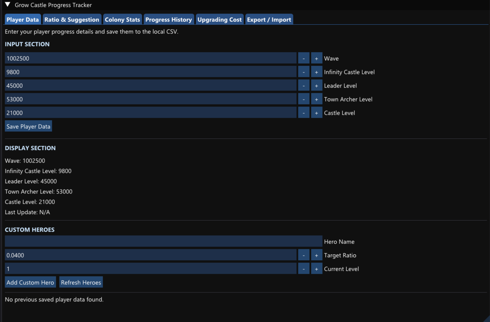
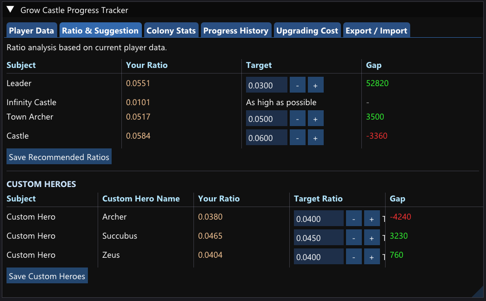
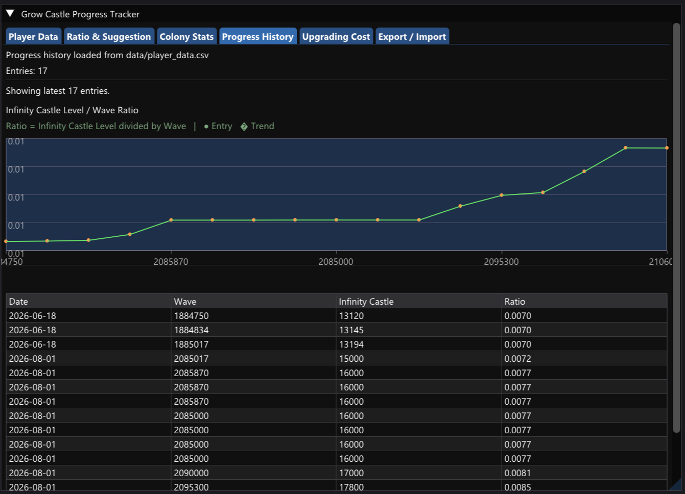

**A Grow Castle progress tracker built to help players analyze their growth, plan upgrades, and keep track of their journey over time.**


## Why?

Hi, I'm miglioDev, and I've been playing Grow Castle for a few years now.

I created this tool because I wanted a better way to track my progress over the long term, analyze my growth, compare efficiency ratios, and calculate upgrade costs, all in one place.

I wanted something more structured and reliable, so I started developing this application: a dedicated progress tracker built specifically for Grow Castle players.

The entire application works offline, and all data is stored locally on your computer. No accounts, no cloud services, and no external dependencies are required.

It is also cross-platform and works on Windows, Linux, and macOS.

I hope this tool can help other players track their progress, plan their upgrades, and push their waves even further! 

## Features

- Track wave progression and Infinity Castle levels over time, keeping all your historical data available for future analysis
- Calculate efficiency ratios and compare them with recommended upgrade benchmarks
- Visualize your progress history with detailed graphs and progression charts
- Calculate the gold required to upgrade Castle or Town Archers from a starting level to a target level
- Store your data locally for long-term tracking and analysis
- Fully offline experience with no external services required
- Cross-platform support for Windows, Linux, and macOS

---

## Build & Run

Download the repository and open a terminal in its root directory. The project provides both a command-line build with Make and a graphical build with CMake.

### Dependencies

- **All platforms:** Git, CMake 3.16 or newer, and a C/C++ compiler
- **Linux:** Make, GCC, and OpenGL development libraries
- **macOS:** Make, Xcode Command Line Tools, and an OpenGL-compatible development environment
- **Windows:** Visual Studio Build Tools or MinGW, plus Ninja if using the Ninja generator

The graphical CMake build downloads GLFW and ImGui during configuration through CMake FetchContent.

### Command-Line Version (Make)

On Linux and macOS, install Make and GCC or Clang, then run:

```bash
make
./bin/grow_castle_tool
```

On Windows, run the same commands from Git Bash, MSYS2, or another environment that provides Make and a C compiler. In PowerShell, run `bin/grow_castle_tool.exe` after building.

### Graphical Version (CMake)

Configure and build with Ninja:

```bash
cmake -S . -B build -G Ninja
cmake --build build --config Release
```

Run the GUI on Linux or macOS:

```bash
./build/bin/GrowCastleProgressTracker
```

On Windows PowerShell, run:

```powershell
.\build\bin\GrowCastleProgressTracker.exe
```

With Visual Studio instead of Ninja, omit `-G Ninja` and build with `cmake --build build --config Release`.
---

##  How to Use

- **Manage Player Data:** Insert, view, or modify wave, leader, heroes, and Infinity Castle statistics
- **Ratios & Suggestions:** Check that your levels are in the correct ratio by looking at the level gap
- **Colony Stats:** View gold production and colony efficiency metrics
- **Progress History:** Visualize your progression over time using graphs
- **Upgrading Cost:** Shows how much gold is needed to upgrade Castle, Town Archers or Hero, Leader and Tower
- **Import / Export Data:** Back up your progress or move it between devices

All your data is stored locally inside the `/data` folder using a CSV file and is automatically updated whenever new stats are saved.

---

##  Features Preview

### Player data
Here you can save all the key data, update the level, or add new heroes along with their respective ratio and level. 



###  Ratio Analysis & Suggestions
Get detailed information about your current set-up, levels and ratios.



---

### Progress Visualization
Check the chart showing the ratio between waves and IC 



---

## Feedback & Contact

Have feedback, suggestions, or found a bug?

Feel free to reach out! You can find me on the official Grow Castle Discord server under **@miglioDev**.

---

⭐ I hope this tool helps you track your progress and enjoy Grow Castle even more. Thanks for checking out my project!
