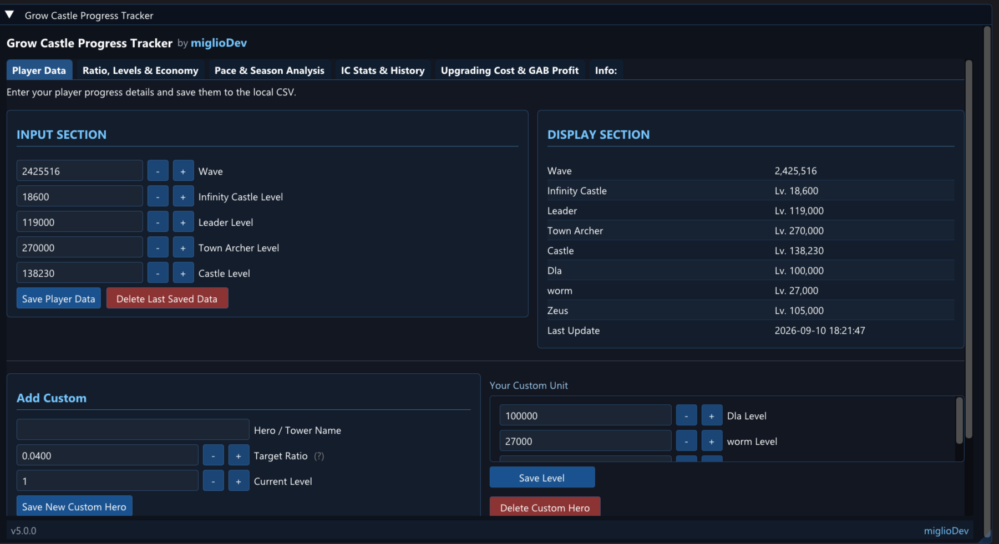
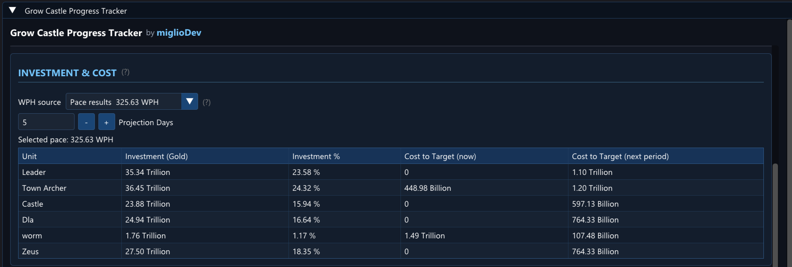
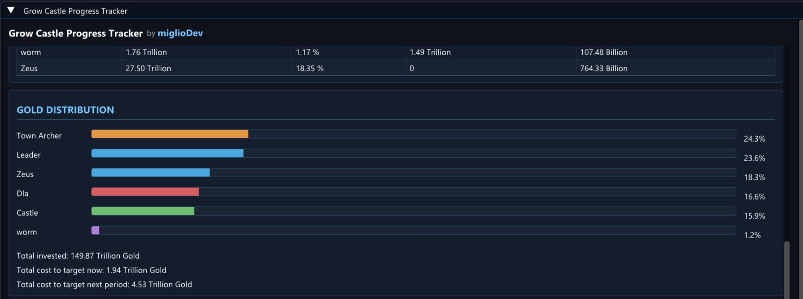
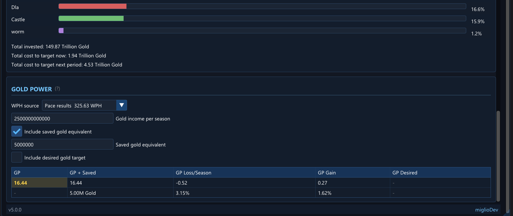
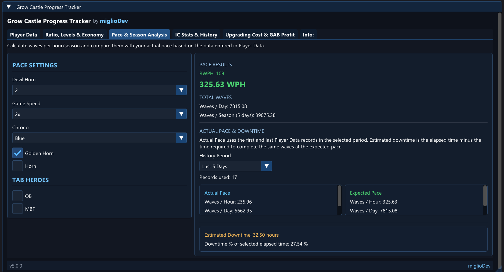
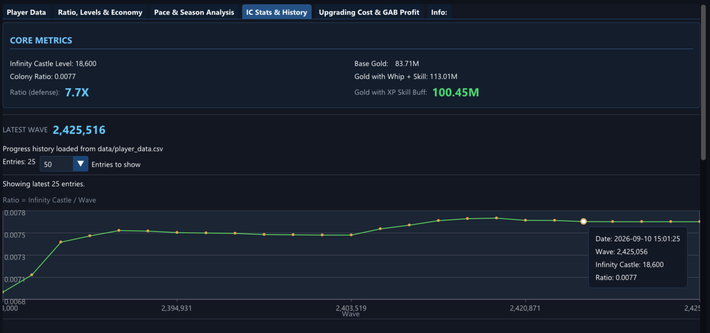
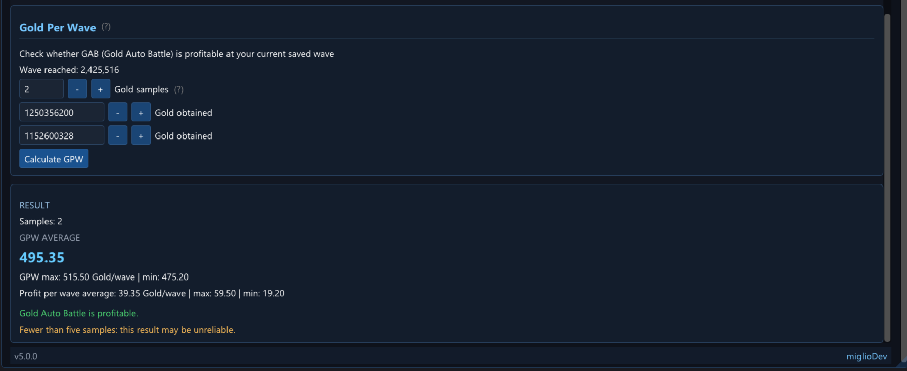

**A free and open-source Grow Castle progress tracker built to help players analyze their growth, plan upgrades, and track their journey over time.**


If you find this project useful, please consider giving it a ⭐ it costs nothing and helps other Grow Castle players discover it.

## Table of Contents

- [Why?](#why)
- [Features Preview](#features-preview)
- [Download & Installation](#download--installation)
- [Build from Source](#build-from-source)
- [How to Use](#how-to-use)
- [Feedback & Contact](#feedback--contact)
- [License](#license)

## Why?

I'm a CS student and a long-time Grow Castle player who built this project to organize and share the metrics, formulas, and tools I've found useful for tracking progress, hopefully it can help other players too!

## Features Preview

### Player Data

Enter and save your current progress, including waves, Infinity Castle, Leader, Town Archer, and Castle levels. Add custom heroes or towers to track alongside the default one.



### Ratios & Economy

Compare your current unit levels with recommended ratios and adjust your targets as you go further in the game.


Review unit investments and cost-to-target planning, based on your current pace, for both the present and the next projection period.



See how your gold is distributed across units.



Gold Power compares total invested gold with your current wave. It supports historical pace or Pace from the Season Analysis section, seasonal gold income, saved gold, and a desired gold target.



### Pace & Season Analysis

Calculate your wave pace, seasonal progress, and estimated downtime from your current tracked snapshots.



---

### IC Stats & History

Review Infinity Castle gold production and follow your Infinity Castle-to-wave ratio over time.



### Upgrading Cost & GAB profit
Calculate the upgrade costs for Heroes, Leaders, Towers, Castle, and Town Archers.


Also, by entering your own values, check whether GAB is profitable and sustainable.



---


## Download & Installation

Pre-built binaries are available for Windows. Linux and macOS users can build from source. See [Build from Source](#build-from-source) below.

### Windows

1. Download the latest Windows ZIP file from the [Releases](../../releases) page.
2. Extract the ZIP file to your preferred location.
3. Open the extracted folder and run `GrowCastleProgressTracker.exe`.

Windows may show a "Windows protected your PC" warning because the application is not digitally signed.

This is expected for independent open-source applications. The source code is publicly available on GitHub, and anyone can inspect how the application works.

Click:
`More info` → `Run anyway`

Keep the `data` folder in the same directory as the executable.

Your progress data is stored locally inside the `data` folder.

---

Follow the installation tutorial This tutorial is valid from version 3 onwards:

[](https://www.youtube.com/watch?v=GamVHt7rb6Y)

---

## Build from Source

This section explains how to compile the application directly from the source code.
Download the repository and open a terminal in its root directory. The project uses CMake to build the graphical application.

### Dependencies

- **All platforms:** Git, CMake 3.16 or newer, and a C/C++ compiler
- **Linux:** GCC or Clang, Ninja (or another CMake generator), and OpenGL development libraries
- **macOS:** Xcode Command Line Tools, Ninja (or another CMake generator), and an OpenGL-compatible development environment
- **Windows:** Visual Studio Build Tools or MinGW, plus Ninja if using the Ninja generator

The graphical CMake build downloads GLFW and ImGui during configuration through CMake FetchContent.

### CMake Build

Configure and build with Ninja:

```bash
cmake -S . -B build -G Ninja
cmake --build build --config Release
```

Run the GUI on Linux or macOS:

```bash
./build/bin/GrowCastleProgressTracker
```

On Windows PowerShell, run:

```powershell
.\build\bin\GrowCastleProgressTracker.exe
```

With Visual Studio instead of Ninja, omit `-G Ninja`, build with `cmake --build build --config Release`, and run `build\bin\Release\GrowCastleProgressTracker.exe` on Windows.

---

## How to Use

1. Open **Player Data** and enter your current wave and unit levels. Save a snapshot whenever you want to record progress. More snapshots improve historical pace and downtime estimates. Always make sure the data you enter reflects your actual progress at the time of saving. Saving incorrect data, or saving a second snapshot shortly after with a significantly different wave because the first one was incorrect, can distort the historical pace and downtime calculations. One accurate snapshot per day, saved consistently, can provide much more reliable results than many inaccurate or rushed snapshots. If you accidentally save incorrect data, you can immediately remove the latest snapshot using the **Delete Last Saved Data** button without affecting your other saved data. A snapshot cannot be saved if any field contains 0 or a negative value.
2. Add optional custom heroes or towers in the **Add Custom** area. Enter their name, target ratio, and level, then save. You can later update and save their levels directly in this tab, or edit their target ratios in the **Ratios & Economy** tab. Use **Delete Custom Hero** if you need to remove one permanently.
3. Use **Ratios & Economy** to compare current ratios with your targets. Adjust and save the recommended ratios (including any custom units) when your build changes; saving here saves any custom hero ratio/level edits made in this tab. This tab also contains investment and cost-to-target planning, gold distribution, and Gold Power.
4. Open **Pace & Season Analysis** and select the settings that match your current setup: Devil Horn, game speed, Chrono, Golden Horn, Horn, OB, and MBF. The tab displays RWPH, WPH, daily waves, seasonal waves, actual pace, and downtime for All Time, Last Month, Last 5 Days, or Last 24 Hours, calculated from your saved Player Data history.
5. Open **Upgrading Cost & GAB Profit** to calculate the gold cost of an upgrade by selecting the unit type and entering the starting and target levels. The **Gold Per Wave (GPW)** section lets you manually enter one or more gold amounts earned from Gold Auto Battle (GAB) runs; it uses your currently saved wave from Player Data and a breakeven point of 456 gold/wave to estimate your average/min/max profit per wave and tell you whether GAB is currently profitable.
6. Use **IC Stats & History** to review Infinity Town gold production and the historical IC-to-wave ratio graph (in Player Data you're supposed to enter the Infinity Town level itself, not the defense) ratio is shown in this tab.
7. Use the **Info** tab to view useful information about the application and the local data files, including their names and location. Your progress is stored in CSV files inside the `/data` folder. These files can be copied elsewhere to create a backup or transferred to another installation or version of the app to carry your saved progress with you.

All your data is stored locally inside the `/data` folder using a CSV file and is automatically updated whenever new stats are saved.
Please do not manually modify the data in this folder. I have already implemented handling for cases where corrupted or incorrectly formatted data was saved, but all modifications should be made through the application.

---

## Feedback & Contact

Have feedback, suggestions, or found a bug?

Feel free to Open an issue on GitHub or reach out! You can find me on the official Grow Castle Discord server under **@miglioDev**.

## License

This project is licensed under the MIT License. See [LICENSE](LICENSE) for details.

---

⭐ I hope this tool helps you track your progress and enjoy Grow Castle even more. Thanks for checking out my project!

Note:
Grow Castle Progress Tracker is an independent open-source project and is not affiliated with the official Grow Castle game developers.
